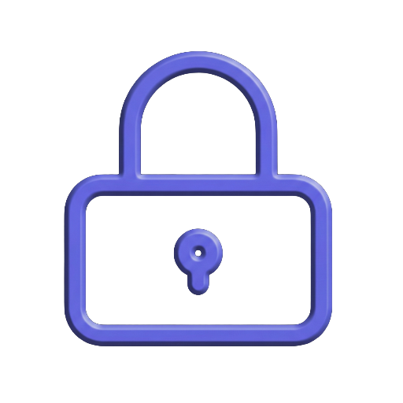

<p align="center">
  
</p>

# Kivarion

Kivarion is a modern, fast, and secure desktop password manager that works with the KeePass format (`.kdbx` files). Built with **Tauri 2** and **Vue 3**, it provides a native user experience with a strong focus on security.

## Key Features

- **Full KDBX 4 support** — securely work with KeePass 2.x databases.
- **Secure decryption** — uses **Argon2** for key derivation, computed by the native Rust backend so the interface stays responsive while a large database is unlocked or saved.
- **Flexible unlock** — open a database with a master password, a key file, or both. The key file is remembered per database.
- **Create databases** — make a brand-new `.kdbx` from the app, protected by a master password.
- **Three-column interface** — convenient navigation with a group tree, entry list, and resizable detail panel.
- **Structure management** — create, rename, and delete groups and entries.
- **Recycle Bin** — deleted groups and entries go to the KeePass Recycle Bin and can be restored to where they came from; deleting them again (or emptying the bin) is permanent.
- **Global search** — the search field in the top bar filters entries across the entire database, regardless of the selected group. It searches the **Title**, **UserName**, **URL**, **Notes**, and **custom fields** by both name and value. Matching is case-insensitive and substring-based. Protected fields, including passwords and hidden custom fields, are excluded from search.
- **Attachment support** — add, preview, export, rename, and delete files attached to entries. Adding a file larger than 10 MB asks for confirmation first: attachments live inside the database, so every later save re-encrypts them.
- **Website favicons** — automatically fetch icons for entries through `icon.horse`. Off-switch in Settings for anyone who would rather not send entry domains to a third party.
- **Password generator** — create strong passwords with configurable options.
- **Auto-save** — every operation is written to the file (rapid edits are coalesced for a fraction of a second, and anything pending is flushed before locking or closing).
- **Personalization** — supports light, dark, and system themes.
- **Saved-data cleanup** — Settings can remove all Kivarion Touch ID passwords, remembered key-file associations, and path-keyed interface preferences without deleting vault files.
- **Native experience** — integrates with the operating system through Tauri, including dialogs, filesystem access, and system paths.

## Platform support

Kivarion targets desktop **macOS, Windows, and Linux** via Tauri. Some features are platform-specific:

- **Touch ID unlock** — **macOS only**. On other platforms the biometric commands report "not supported" and the option is unavailable; unlock there is password-only.
- **Quick Look attachment preview** — **macOS only** (uses `qlmanage`). In-app image/PDF preview and export work on all platforms.

## Technology Stack

| Component    | Technology                                                                                  |
| ------------ | ------------------------------------------------------------------------------------------- |
| **Core**     | [Tauri 2](https://v2.tauri.app/) (Rust)                                                     |
| **Frontend** | [Vue 3](https://vuejs.org/) (Composition API)                                               |
| **State**    | [Pinia](https://pinia.vuejs.org/)                                                           |
| **Routing**  | [Vue Router](https://router.vuejs.org/)                                                     |
| **KDBX**     | [kdbxweb](https://github.com/keeweb/kdbxweb)                                                |
| **Crypto**   | [RustCrypto argon2](https://github.com/RustCrypto/password-hashes) (native, in the backend) |
| **Styling**  | Vanilla CSS (Variables & Glassmorphism)                                                     |

## Development

[Bun](https://bun.sh/) is required.

```bash
# Install dependencies
bun install

# Run in development mode (Tauri + Vite)
bun run tauri dev

# Build the production version
bun run tauri build

# Lint and format
bun run lint          # ESLint (Vue + JS)
bun run format        # Prettier (write)
bun run format:check  # Prettier (verify only)

# Unit tests
bun test

# Optional E2E smoke (requires tauri-driver, a built app, and a platform supported by tauri-driver)
bun run tauri build --debug
bun run test:e2e

# Bump the app version everywhere it's duplicated
# (package.json, src-tauri/Cargo.toml, src-tauri/Cargo.lock)
bun run bump 0.6.0
```

## Releases

Windows and Linux packages are built by the **Release Application** GitHub Actions workflow ([`release.yml`](.github/workflows/release.yml)), triggered manually (`workflow_dispatch`); it tags `v<version>` and publishes a (draft) GitHub release via `tauri-action`. The macOS build is produced locally with a signing/notarization script (`build-mac.sh`, not committed — it contains Apple Developer credentials): `./build-mac.sh [universal|intel|silicon|both]`.

> **Note (Linux/AppImage):** the release pipeline strips the bundled Wayland/DRM client libraries (`libwayland-*`, `libgbm`, `libdrm*`) from the AppImage after packaging so they resolve from the host — otherwise WebKitGTK's EGL init fails on recent Mesa (see the repack step in [`release.yml`](.github/workflows/release.yml)). A locally built AppImage does not get this treatment; if it aborts with `EGL_BAD_PARAMETER`, remove those libraries from the AppImage the same way.

## Test Database

`TestDatabase.kdbx` is a sample database for local testing only. It contains no real secrets.

Password: `123`

## License

Kivarion is licensed under the GNU General Public License v3.0 only. See [LICENSE](LICENSE).

## Project Structure

```
src/
├── main.js              # Vue and crypto engine initialization
├── App.vue              # Root component and global style tokens
├── store.js             # Pinia store (database, credentials, theme)
├── pages/               # Main screens: HomePage, DatabasePage, SettingsPage
├── components/          # Modular UI (modals, header, EntryDetail, GroupTree, etc.)
├── composables/         # Shared logic (auth, actions, resizing, icons, attachments)
├── crypto-init.js       # points kdbxweb's Argon2 at the Rust backend
├── dbHelper.js          # Low-level filesystem operations
└── utils.js             # Formatting and password generation utilities

src-tauri/
├── capabilities/        # Plugin permission configuration (http, dialog)
├── src/
│   ├── main.rs          # Rust entry point
│   └── lib.rs           # Plugin registration and custom commands
└── tauri.conf.json      # Tauri build configuration
```

## Security

- The master password is not persisted by default. **If you enable Touch ID unlock, the password is stored in the macOS Keychain** so it can be retrieved (as plaintext, into the app) after a successful biometric check. It is protected at rest by the OS Keychain, not "never stored". Touch ID is only triggered by an explicit action — Kivarion never prompts for it automatically.
- Sensitive fields are handled through the `kdbxweb` library's `ProtectedValue`.
- Favicon lookups send the entry's domain (nothing else) to `icon.horse`. Turn "Download website icons" off in Settings to keep every domain on the machine; the downloaded-icon cache is dropped when the database locks.
- The webview has **no direct filesystem access**: all database/attachment file I/O goes through dedicated Rust commands operating only on a path you picked via a native dialog.
- On macOS, previewing an attachment with Quick Look writes the decrypted file to a unique private temporary directory and deletes it after the preview closes. Stale files left by a crash are removed on the next launch. macOS Quick Look may still retain thumbnails or preview data in OS-managed caches, which Kivarion cannot purge.
- Saves are durable and atomic (temp file → fsync → rename), and detect external modification before overwriting. Rotating `.bak` backups (configurable in Settings) are kept next to the database; they are encrypted KDBX copies, not plaintext.
